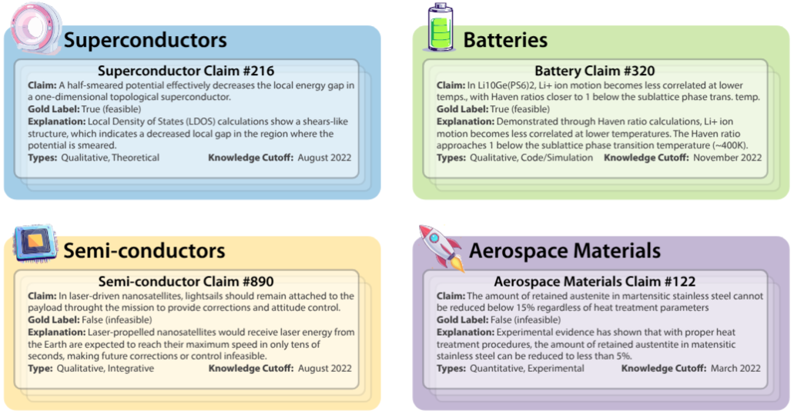
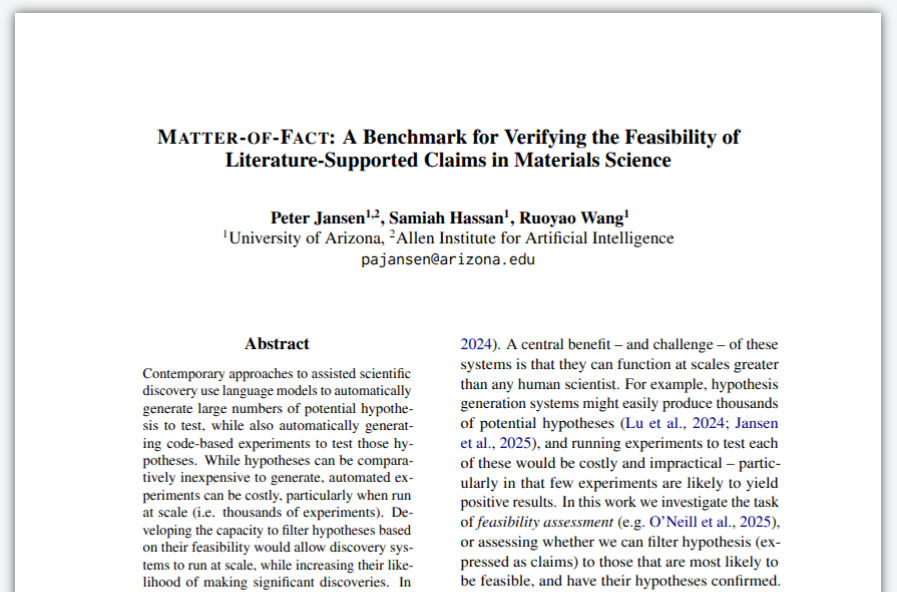
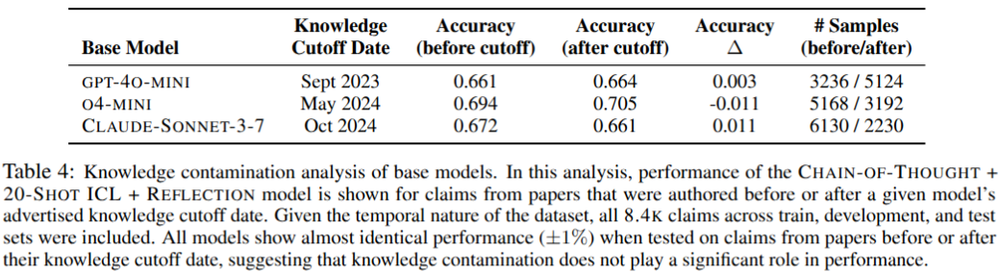

# Matter-of-Fact: A Benchmark for Verifying the Feasibility of Literature-Supported Claims in Materials Science

<div align="center">  

</div>

---

This is the repository for **Matter-of-fact**, a benchmark of approximately 8,000 claims extracted or derived from material science papers on Arxiv.  The dataset is intended to be used for *feasibility assessment* tasks, which aim to determine whether a claim is likely to be feasible or infeasible, and are related to *claim verification* tasks.  The repository also includes the baseline models from the paper. 

---

# Table of Contents

- [1. Paper](#1-paper)
- [2. Benchmark](#2-benchmark)
- [3. Baseline Models](#3-baseline-models)
- [4. Citation](#4-citation)
- [5. License](#5-license)
- [6. Contact](#6-contact)


<span id='1-paper'/>

# 1. Paper

The paper [Matter-of-Fact: A Benchmark for Verifying the Feasibility of Literature-Supported Claims in Materials Science](https://arxiv.org/abs/2506.04410) is available on Arxiv. 

<div align="center">  

</div>


<span id='2-benchmark'/>

# 2. Benchmark

## 2.1 Train, Validation, and Test Sets

The train, validation, and test sets are available in: [/benchmark/](/benchmark/)

| Set   | Size | Years Covered | Filename                                                                                                           |
|-------|------|---------------|--------------------------------------------------------------------------------------------------------------------|
| train | 1376 | 2022          | [matteroffact.train.2022.1376.json](/benchmark/matteroffact.train.2022.1376.json)                                 |
| valid | 2538 | 2023          | [matteroffact.validation.2023.2538.json](/benchmark/matteroffact.validation.2023.2538.json)                       |
| test  | 4446 | 2024-2025     | [matteroffact.test.20242025.4446.json](/benchmark/matteroffact.test.20242025.4446.json)                           |


## 2.2 Feasibility Problem Format

Below is an example of one feasibility problem from the benchmark:
```json
    {
        "claim_id": "2206.01072v1_9_T",
        "claim_text": "In Fe chains on Rh(111) surface, nearest neighbor isotropic exchange interactions are ferromagnetic while next nearest neighbor interactions are antiferromagnetic, with the nearest neighbor coupling between edge atoms reaching values of approximately 0.6 mRy.",
        "gold_label": true,
        "metadata": {
            "type": "code/simulation",
            "problem_description": "Isotropic exchange interactions in Fe chains on Rh(111)",
            "supporting_facts_from_paper": [
                "In Table \\ref{tbl:jij-k} we present the nearest neighbor (NN) and next nearest neighbor (NNN) isotropic interactions between the Fe atoms. Apparently, the NN and NNN isotropic interactions are ferromagnetic (FM) and antiferromagnetic (AFM), respectively. (code)",
                "The leading terms in the spin model are the isotropic exchange interactions. In Table \\ref{tbl:jij-k} we present the nearest neighbor (NN) and next nearest neighbor (NNN) isotropic interactions between the Fe atoms. (code)",
                "For the 4-atom chain, the nearest neighbor interaction between sites 1-2 is 0.604 mRy, for the 5-atom chain it is 0.572 mRy, for the 6-atom chain it is 0.686 mRy, and for the 7-atom chain it is 0.605 mRy. (code)"
            ],
            "explanation": "The paper explicitly states that in Fe chains on Rh(111), nearest neighbor isotropic exchange interactions are ferromagnetic while next nearest neighbor interactions are antiferromagnetic. Table values show that the nearest neighbor coupling between edge atoms (sites 1-2) is consistently around 0.6 mRy across chains of different lengths: 0.604 mRy for 4-atom chains, 0.572 mRy for 5-atom chains, 0.686 mRy for 6-atom chains, and 0.605 mRy for 7-atom chains. These quantitative values directly support the claim.",
            "quant_or_qual": "quantitative",
            "paper_id": "2206.01072v1",
            "topics": [
                "magnetic nanoclusters",
                "first principles calculations",
                "spin-spiral states",
                "Dzyaloshinsky-Moriya interaction",
                "magnetic ground states",
                "Fe atomic chains",
                "topological superconductivity",
                "theme_superconductors"
            ],
            "published_date": {
                "year": 2022,
                "month": 6
            },
            "exclude_date": {
                "year": 2022,
                "month": 5
            }
        }
    }
```

The field descriptions are below:
- `claim_id`: A unique ID for the claim, which includes the arxiv source paper, an (arbitrary) index for the claim, and whether or not the claim was generated to be true or false (T/F).
- `claim_text`: The text of the claim.  This is (nominally) the only information that a feasibility verification/claim verification model should recieve when performing the feasibility/claim verification task.
- `gold_label`: Whether the claim is true/feasible (`true`), or false/infeasible (`false`).
- `metadata.type`: The type of claim, from 4 broad categories: `code/simulation`, `experimental`, `theoretical`, or `integrative`.
- `metadata.problem_description`: A natural language description of the broad scope/domain of the claim.
- `metadata.supporting_facts_from_paper`: A set of supporting facts from the paper.  These are automatically generated by the LLM, so they may be summarative rather than extract exact text spans.
- `metadata.explanation`: An automatically generated explanation for why the gold label is believed to be correct.
- `quant_or_qual`: Is this claim problem `quantitative` or `qualitative`?
- `paper_id`: The original source paper (an Arxiv ID).  The model generated this claim after reading the full text of this article.
- `topics`: A list of automatically labeled topics of the source paper.
- `published_date`: The date that the earliest version of this paper appeared on Arxiv.
- `exclude_date`: For the feasibility verification task, exclude any artifacts (e.g. papers, knowledge sources, etc.) whose knowledge comes after this date.

## 2.3 Scoring

A few notes on scoring: 
- The task is framed as a binary classification problem, where a model provides each claim with a binary label (`true/feasible`, or `false/infeasible`).
- There are an equal number of `true` and `false` claims, so chance performance is 50%.
- A model's performance is simply its classification accuracy across the test set.  (For example, if Model X correctly predicts the labels for `3000` claims, and incorrectly predicts the labels for `1446` claims, then its accuracy will be `3000 / 4446 = 67.5%`).


## 2.4. Feasibility and Temporal Filtering

Matter-of-Fact frames feasibility detection as a temporally-filtered claim verification task.  It's very challenging to generate accurate and realistic estimates of the feasibility of a new claim, since (by definition) the experiment hasn't been run yet, so we don't know the result.  Matter-of-Fact gets around this challenge by extracting genuine claims from recent papers, and then (for each claim) making a negative/infeasible version.  The benefits of this are that it makes the feasibility data much more realistic, and based on actual scientific results. The drawbacks are that it adds complexity to the model evaluation procedure: When solving the claim verification problem, the model shouldn't have information available to it that was published after the original paper the claim came from was published -- otherwise it could trivially solve the feasibility verification problem by retrieving papers (including the original source paper) that know the results of the experiment (that 'temporally unrestricted' baseline is provided in Table 3). 

We've designed the dataset with this temporal filtering in mind, and there are two possible ways to perform this filtering: 
- **Easy:** All the claims in the test set are from papers posted in January 2024 or after.  You can simply exclude all knowledge from 2024 onward in your retrieval system.
- **Claim-specific:** Each claim has a knowledge cutoff-date (`exclude_date`), so if you'd like your model to use all knowledge up to just before the source paper was published, that is possible too.

### 2.4.1. Wait, won't models be trained on papers authored after 2024?  Will this contaminate the data? 

This is a potential issue with all temporal-prediction-framed problems, however, our analysis (Table 4) suggests that this is not currently an issue for the models we tested in the paper. 

If we group all the claims together (from train (2022), validation (2023), and test (2024-2025)), and then look at base model performance on claims authored before or after the model's advertised knowledge cut-off date, then the performance of the models before and after the knowledge cutoff date appears nearly identical.  This suggests that either these models weren't trained on this data, or (alternatively) that they're not able to easily access/use this knowledge, if they were trained on it. 

**Contamination-Aware Baseline Performance:** If you're using a new base model, we suggest running the same kind of contamination analysis in Table 4 to see how contaminated your model is.  You might then consider whatever level of contamination exists as the effective baseline to beat for your expermental models.

<div align="center">  

</div>


<span id='3-baseline-models'/>

# 3. Baseline Models

The paper includes code for a number of baseline models:

- `Prompt-based Models`: Using chain-of-thought, in-context-learning, reflection, etc.
- `Retrieval-Augmented Generation (RAG) Models`: Using snippets retrieved from Semantic Scholar, that are then provided to a prompt.
- `Code-Generation Models`: Using an LLM to generate relevant code, which is then run, and the results are provided to a prompt to help decide the feasibility verification problem.

The code for these baseline models is provided in: [/models/](/models/) .

## 3.1. Threading

All the baseline models are threaded, and send a (large) number of parallel requests to the model provider.  You should likely start with a very low number of threads (like 1), and scale up as appropriate.  The number of threads are generally controlled with the `NUM_WORKERS` parameter in the calls of the main function of each model. 

You will likely wish to adjust the threading speeds and delays of the various API calls (OpenAI, Anthropic, Semantic Scholar, etc.) to meet your desired rate limits. 

## 3.2. Cost

Running these models can incur significant cost.  You may wish to make a subset of the data (e.g. 10 or 100 claim verification problems) to use for debugging/evaluation purposes, before running the full models. 

## 3.3. Semantic Scholar API

The Semantic Scholar model uses the Semantic Scholar snippet search [(docs)](https://api.semanticscholar.org/api-docs/#tag/Snippet-Text), which requires an API key [(request form)](https://www.semanticscholar.org/product/api#api-key).  

## 3.4. CodeScientist-based execution

The code model uses a limited version of CodeScientist, and requires much of the same setup (e.g. Modal.com).  Please see the CodeScientist repository for details:
[https://github.com/allenai/codescientist](https://github.com/allenai/codescientist)

## 3.5. Oracle Paper Baseline

The oracle paper baseline is essentially a retrieval-augmented-generation (RAG) system that feeds the original paper that the claim was generated from into the prompt.  The code is provided, but for copyright purposes, you would need to rebuild the source paper index.


<span id='4-citation'/>

# 4. Citation

The citation for Matter-of-Fact is:
```
@misc{jansen2025matteroffactbenchmarkverifyingfeasibility,
      title={Matter-of-Fact: A Benchmark for Verifying the Feasibility of Literature-Supported Claims in Materials Science}, 
      author={Peter Jansen and Samiah Hassan and Ruoyao Wang},
      year={2025},
      eprint={2506.04410},
      archivePrefix={arXiv},
      primaryClass={cs.AI},
      url={https://arxiv.org/abs/2506.04410}, 
}
```


<span id='5-license'/>

# 5. License

## 5.1. Matter-of-Fact Benchmark License

The Matter-of-Fact benchmark claims are built from Arxiv papers that are licensed under a [Creative Commons By-Attribution 4.0](http://creativecommons.org/licenses/by/4.0/) License, where attribution is provided by each claim including the Arxiv ID of the paper that it was derived from.

The Matter-of-Fact data/benchmark are also released under the same CC-BY-4.0 license. 

## 5.2. Matter-of-Fact Code / Baseline Model License

Matter-of-Fact code / baseline models are released under an Apache 2.0 License.  The text of that license is included in this repository.

```
Disclaimer of Warranty. Unless required by applicable law or
agreed to in writing, Licensor provides the Work (and each
Contributor provides its Contributions) on an "AS IS" BASIS,
WITHOUT WARRANTIES OR CONDITIONS OF ANY KIND, either express or
implied, including, without limitation, any warranties or conditions
of TITLE, NON-INFRINGEMENT, MERCHANTABILITY, or FITNESS FOR A
PARTICULAR PURPOSE. You are solely responsible for determining the
appropriateness of using or redistributing the Work and assume any
risks associated with Your exercise of permissions under this License.
```

<span id='6-contact'/>

# 6. Contact

For any questions, please contact Peter Jansen (`pajansen@arizona.edu`).  For issues, bugs, or feature requests, please submit a [github issue](https://github.com/cognitiveailab/matter-of-fact/issues).


